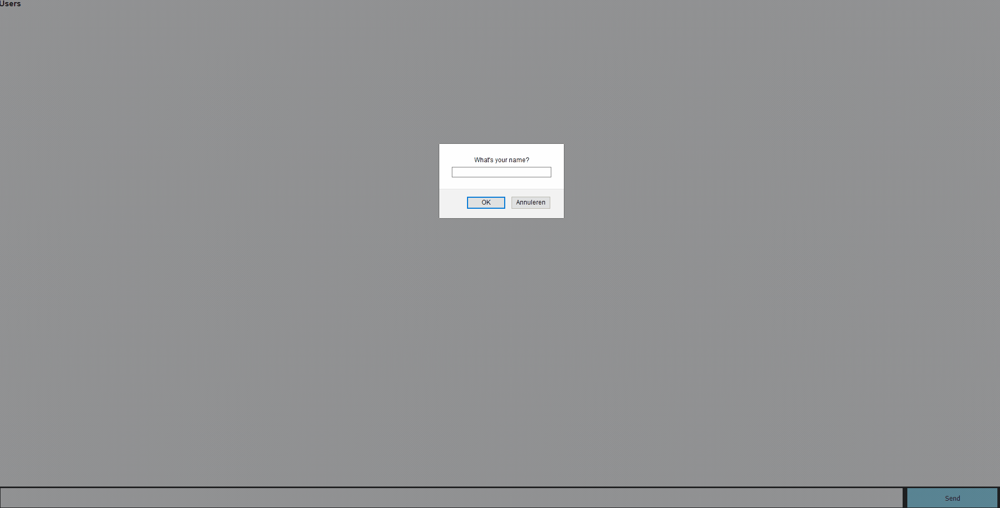

# Generate a playlist together.


[Here you can find my live application](https://assignment-1-dkgydvdhlj.now.sh/)

## where it started

This is a start of an app that uses websockets that people can join and search songs and add them to the queue.


I started with the chat application

This application is a chat application that works realtime using the socket.io api.


## Getting started

* Clone the repo
* Navigate to the repo and when inside the repo go into assignment-1
* Get all dependencies ```npm install```
* Start application ```npm start```
* it wil run on [http://localhost:3000](http://localhost:3000)
* Start for development ```npm run dev```


## Dependencies
- Node
- Express
- EJS
- Socket.io
- bodyParser
- Nodemon (for the dev enviroment)

## Features

This app is an start for an application that will be a Realtime Music player with Queue's. You can send a title suggestion and see your name (that you entered in the prompt). This is being done real time so you can keep sending suggestions. When an api (eg. spotify, soundcloud or youtube) is connected the songs will be played (as a live playlist).


## Code
* EJS - I used EJS for the first time as templating engine.
I used it pretty light in my application. But i will use it more when i add more to the application.

```JS
<ul>
  <% playlist.forEach(function(song) { %>
    <li><%= song.artist %> - <%= song.title %> (<%= song.user || 'Anoniempje' %>)</li>
  <% }); %>
</ul>
```

* Socket.io - On the Socket.io side i used the connection and emitted the function. In update list I emitted the playlist object.

```JS
io.on('connection', (socket) => {
  socket.on('newSong', (newSong) => {
    playlist.push(newSong);
    io.emit('updatelist', playlist);
  });
});
```

  * on the client..
Listen to the socket - updatelist and i get the updated playlist (from the server). And checks if the user is filled in (from the prompt) if not your name will be "Anoniempje".

```JS
socket.on('updatelist', function (playlist) {
  document.querySelector('ul').innerHTML = playlist
    .map(song => `<li>${song.artist} - ${song.title} (${song.user || 'Anoniempje'})</li>`)
    .join('');
});
```

_Playlist object_
```JS
const playlist = [
  {
    title: 'Till it\'s over',
    artist: 'Anderson.Paak'
  },
  {
    title: 'Da Vinci',
    artist: 'Weezer'
  },
  {
    title: 'Stadaarnietzodoeiets',
    artist: 'Fokko'
  },
];
```


## Todo
* [x] Express server.
* [x] Socket Connection.
* [x] Playlist updates for everyone.
* [x] Add usernames.
* [ ] CSS (_my planning is horrible :(_)
* [ ] Rooms (_wanted to fix this, this week_).
* [ ] Api connection.
  * Will be updated..
